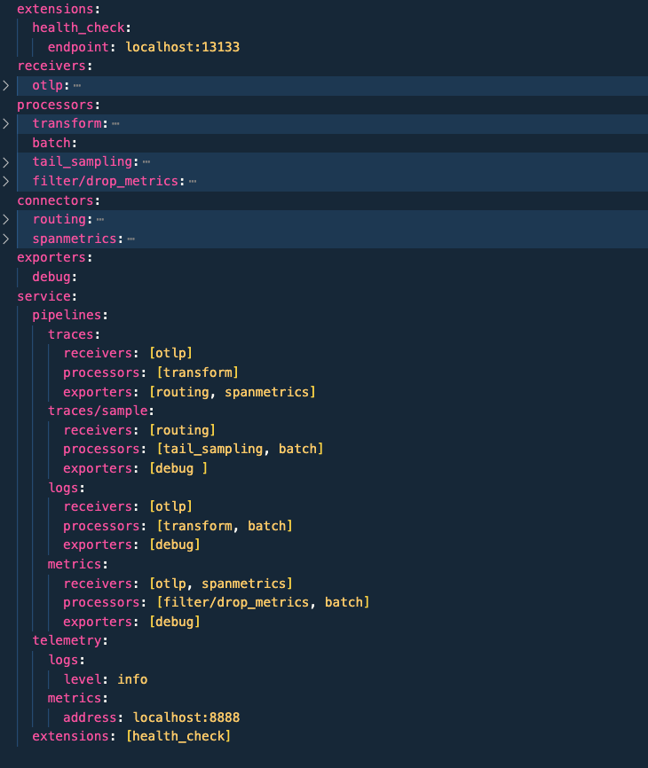

# 3 Ways to Build Your Custom OpenTelemetry Collector Distro

The **OpenTelemetry Collector** is a powerful tool for collecting and processing telemetry data.

Most users start with the **contrib collector**, a pre-built version of the OpenTelemetry Collector that includes a wide range of receivers, processors, and exporters. It’s a great starting point because it provides a lot of functionality out of the box.

However, this strength is also its weakness. It’s easy to configure and experiment with since it includes all available components — but it also slows the collector down, as it loads everything, even unused components. In a **production environment**, a more performant, streamlined solution is often required.

---

## Vendor-Specific Distros

Several vendors offer their own distributions of the OpenTelemetry Collector, optimized for their platforms and use cases. These are vendor-approved and guaranteed to be compatible with their services and tools. However, they often include only a subset of components — limiting the collector’s flexibility and capabilities.

In one project I worked on, we transmitted telemetry to a commercial backend that billed based on **GBs ingested**. To reduce ingestion costs, we wanted to use a combination of the `spanmetrics` connector, a routing processor, and the `tail_sampling` processor. Unfortunately, these weren’t available in the **AWS Distro**, so we had to build our own custom OpenTelemetry Collector Distro.

---

## Using the OpenTelemetry Collector Builder (OCB)

The **OpenTelemetry Collector Builder (OCB)** is a tool that allows you to build a custom OpenTelemetry Collector distribution. It’s a command-line tool that takes a configuration file as input and compiles a custom Collector binary.

📖 [OpenTelemetry Collector Builder Documentation](https://opentelemetry.io/docs/collector/custom-collector/)

That’s the theory. In practice, I ran into two main issues:

1. I’m not a Go developer and didn’t want to install Go or related tooling.
2. The heart of OCB is the `builder-config.yaml`, but all examples I found were basic and not applicable to real-world production scenarios.

---

## Containerizing the OCB

To solve problem #1, you can run the OCB inside a container. It’s available as a Docker image, meaning you don’t need to install any local dependencies. This approach is well-documented, and there are several blog posts and GitHub examples available.

---

## The 3 Ways to Create a `builder-config.yaml`

### 1. Manually Adding Components

I initially tried to build `builder-config.yaml` manually, referring to the OCB documentation and community blog posts. I had to:

- List the components (receivers, processors, exporters, etc.) I needed.
- Look up the corresponding Go modules and specify their versions.

> ⚠️ **Versioning is important.** You specify the builder version at the top of the file, but individual components may use different versions.

After many build errors and deep dives into the **contrib** and **core** repositories, I learned:
- Most components use the **beta version** (e.g., `v0.123.0`).
- Some have **stable versions** (e.g., `v1.31.1`).

Eventually, I managed to build a working custom collector. But the process was **painful, error-prone, and hard to maintain**. I wouldn't recommend this method for production.

---

### 2. Manually Removing Components

While exploring GitHub, I stumbled upon the [official builder-config.yaml](https://github.com/open-telemetry/opentelemetry-collector-contrib/blob/main/cmd/otelcontribcol/builder-config.yaml). This file includes **all available components** and their versions.

You can use this file as a **starting point**, then remove the components you don’t need. This is far easier than building the config from scratch — but it’s still a **manual process**.

Be careful: removing the wrong component can result in a broken build. Still, this method is **more reliable** and **easier to maintain** than adding components from scratch. Since you’re starting with the official configuration, staying up-to-date with upstream changes becomes much simpler.

> But remember: **The biggest cause of errors sits in front of the screen.**

---

### 3. Using `ocbConfig` to Generate `builder-config.yaml`

To eliminate human error, I automated the process with a tool called **`ocbConfig`**.

Here’s the idea:

> Most people start with the contrib collector and create a working `config.yaml`. This config includes references to all required components. So why not use that file to automatically generate `builder-config.yaml`? 

Here is an example of a **`config.yaml`** file:

**`ocbConfig`** is a Deno application written in **TypeScript**. It:

- Downloads the latest official `builder-config.yaml` from the OpenTelemetry Collector contrib repo.
- Parses your `config.yaml` (placed in a `config/` folder).
- Filters out unused components.
- Outputs a minimal, valid `builder-config.yaml` with only the components you actually use.

🔧 The tool is available on [GitHub](https://github.com/Meider4cloud/ocbConfig).

I also included a **Dockerfile** and **docker-compose.yaml** to containerize `ocbConfig`. This means you can:

- Run it locally without installing anything.
- Integrate it easily into your **CI/CD pipeline** to always generate an up-to-date custom Collector distro.

---

## Conclusion

Building a custom OpenTelemetry Collector distro doesn’t have to be hard.

- If you're just starting, the contrib collector is great for prototyping.
- For production, vendor distros may not offer the flexibility you need.
- The **OCB** gives you full control — but managing `builder-config.yaml` is the hardest part.

That’s where **`ocbConfig`** shines. It automates the painful parts, reduces error, and makes building custom collectors easier and repeatable — especially in CI/CD.

> With `ocbConfig`, you stay close to the official release and keep your custom collector lean and maintainable.
